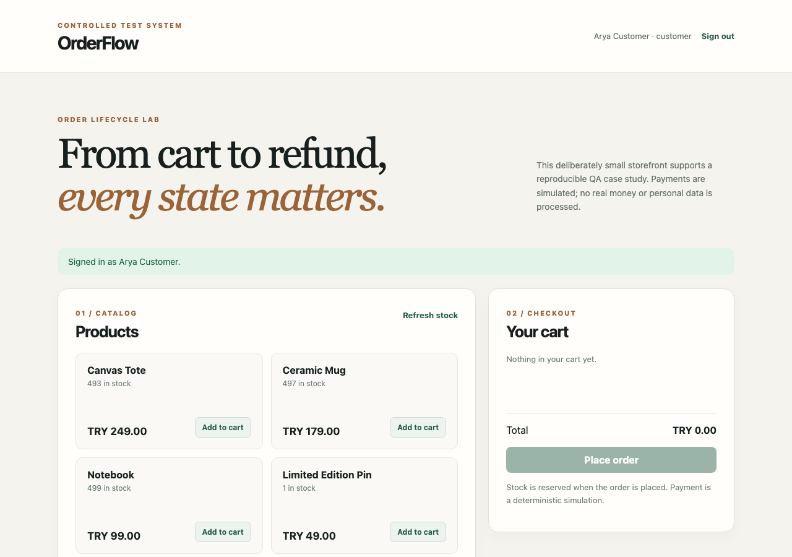

# OrderFlow QA Case Study

An evidence-led Junior QA portfolio case study prepared for Arya Tulper. A deliberately small, controlled commerce system makes order, payment, cancellation and refund behaviour testable through requirements, exploratory/manual cases, Postman/Newman, Playwright/TypeScript, SQL and CI.



**This is a test system, not a real shop.** Payments and refunds are ledger simulations; there is no payment provider, shipping, taxation or personal data. The demo accounts and password are public by design. Do not deploy it as a production commerce service.

## What to review first

1. [Requirements and state model](docs/requirements.md), plus [actor/activity diagrams](docs/diagrams.md) — explicit business rules and scope.
2. [Risk-based test plan](docs/test-plan.md) and [20 selected test cases](docs/test-cases.md).
3. [Traceability matrix](docs/traceability.md) — each important rule maps to a test and evidence.
4. [OpenAPI contract](docs/openapi.yaml), [Postman collection](postman/OrderFlow.postman_collection.json), [Playwright tests](tests/e2e) and [SQL invariants](db/validations.sql).
5. [A genuine defect found and fixed](docs/defects/BUG-001.md), plus [clearly labelled report-writing exercises](docs/defect-exercises.md).
6. [Local execution record](docs/test-execution.md) — exact checks run and remaining verification limits.

### Code reading path

Start with [state rules](src/domain.ts), then follow the order/payment/cancellation/refund routes in [the API](src/app.ts). [Database setup](src/db.ts) and [schema](db/schema.sql) explain transactions and stored records; [the storefront](public/app.js) shows what a customer sees. Finally, compare [API race/permission tests](tests/e2e/api-contract.spec.ts), [UI journeys](tests/e2e/order-flow.spec.ts) and [SQL invariants](db/validations.sql) with those rules. Short comments in these files call out the decisions that are easy to miss.

## Run locally

Requires Docker with Compose and Node.js 24.

```bash
npm ci
docker compose up --build -d
curl http://localhost:3000/api/health
npx playwright install chromium
npm run typecheck
npm run test:unit
npm run test:api
npm run test:e2e
npm run test:sql
```

Open [http://localhost:3000](http://localhost:3000). On first startup the app creates its schema and seeds four products and three demo accounts:

| Role | Email | Password |
| --- | --- | --- |
| Customer | `arya@example.test` | `demo123` |
| Second customer | `other@example.test` | `demo123` |
| Admin | `admin@example.test` | `demo123` |

To stop: `docker compose down`. A named PostgreSQL volume preserves data between runs. For a *fresh disposable test database only*, `docker compose down -v` removes that volume and all its order data. CI starts from a fresh environment on each run.

## Test strategy

| Layer | Purpose | Command |
| --- | --- | --- |
| Unit | State and refund boundary rules | `npm run test:unit` |
| API | Contract, negative paths, access control, idempotency | `npm run test:api` |
| UI + API | Critical user journeys and cross-user checks | `npm run test:e2e` |
| SQL | Financial and state invariants across persisted records | `npm run test:sql` |

The [GitHub Actions workflow](.github/workflows/qa.yml) starts PostgreSQL and the app with Compose, runs all layers, and uploads JUnit/HTML/trace evidence. After a successful non-PR run it also packages the verified application as a downloadable delivery artifact. This demonstrates CI plus a release-ready delivery step; there is **no automatic production deployment** without a chosen destination. Failure artifacts are retained; a green badge is intentionally not shown until this repository has a real public CI run.

`npm audit --omit=dev` reports no production dependency advisories as of the local check. The separate Newman development dependency currently brings upstream transitive advisories; the collection runs only on controlled local/CI test data. This is documented rather than hidden, and should be rechecked before consuming untrusted collections or deploying a runner.

### Automation choices

UI automation covers only high-value checkout and cancellation journeys. API tests cover state boundaries more quickly and reliably. SQL asserts persisted invariants instead of duplicating business logic in screenshots. Test data is seeded and isolated from third-party services. The limited-stock product is reserved for a negative test, and the suite does not consume it.

## Architecture and boundaries

`public/` is a small vanilla-JavaScript UI; `src/` is a TypeScript/Express API; PostgreSQL is the source of truth. The server computes all totals in integer cents. Every stock, payment, cancellation and refund mutation is transactional. Rows are locked during concurrent order/payment/refund changes. The UI uses a short-lived (24-hour) demo bearer session. The admin can issue monetary refunds; customers cannot. A refund does **not** represent a physical return or restock. Cancelling a paid, unrefunded order creates a full cancellation refund and restocks; a partially refunded order cannot be cancelled.

This portfolio deliberately omits real gateway integration, shipment, coupons, microservices, load testing and a second browser-automation framework. These are out of scope, not implied capabilities.

## SQL spot-check

After the API/UI suites create orders, connect to PostgreSQL and inspect data, or run `npm run test:sql`. A non-empty result from [db/validations.sql](db/validations.sql) is a failed invariant; it also fails if no order, payment or refund data exists, avoiding a vacuous green check. Example manual check:

```bash
docker compose exec db psql -U orderflow -d orderflow -c "SELECT o.id, o.status, o.total_cents, COALESCE(SUM(r.amount_cents),0) AS refunded_cents FROM orders o LEFT JOIN refunds r ON r.order_id=o.id GROUP BY o.id ORDER BY o.id DESC LIMIT 10;"
```

## Ownership and honesty

The application exists to make QA artefacts reproducible. [BUG-001](docs/defects/BUG-001.md) was genuinely observed and fixed during this project's visual QA pass. The other defect exercises are writing samples, not evidence of bugs found in an external product. File future genuine findings through the issue template with build SHA, steps, expected/actual result and evidence; link the fix and regression test. Do not claim simulated findings as real industry experience. Before publishing under Arya's profile, she should review the implementation, run the suite herself, and be able to explain the business rules and test choices in an interview.
