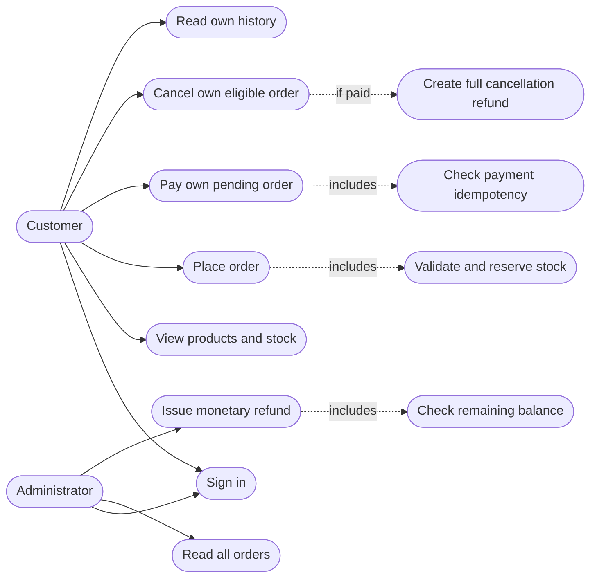
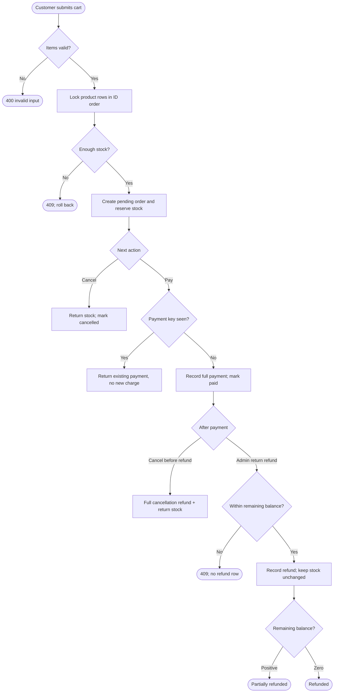

# Workflow diagrams

These diagrams make the scope and actor boundaries reviewable in GitHub. They are a use-case view and an activity flow; implementation details remain in the API contract and requirements.

## Use-case view

## Checkout and after-sale activity

