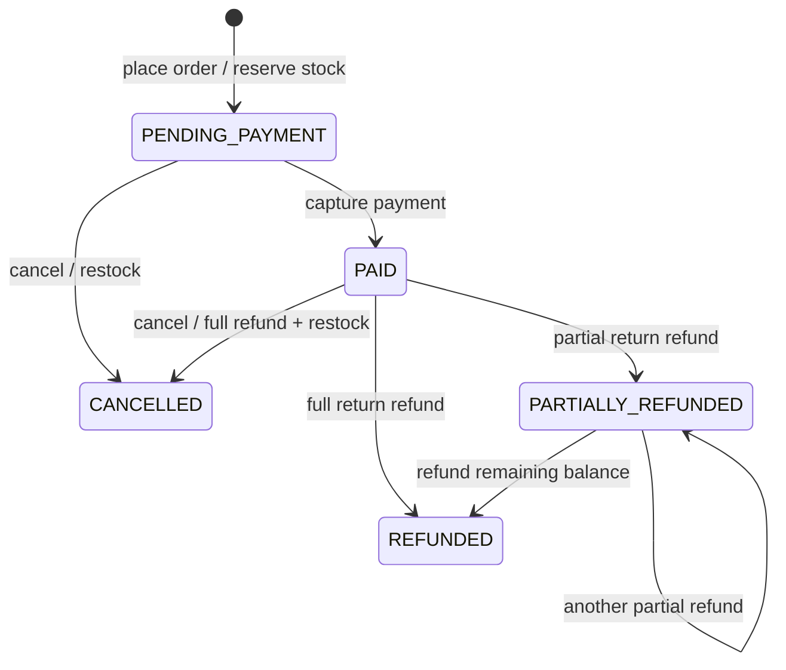

# Requirements and state model

## Goal and actors

The test system demonstrates a customer's order lifecycle and an administrator's monetary refund action. It is intentionally constrained so a QA candidate can reason about business rules, risk, state transitions and data consistency.

- **Customer:** signs in, views products, places and pays for own orders, cancels eligible orders, reads own history.
- **Administrator:** reads all orders and issues partial/full monetary refunds. An admin cannot place/pay/cancel a customer order.

## User stories and acceptance criteria

| ID | User story | Acceptance criteria |
| --- | --- | --- |
| US-01 | As a customer I want to place an order so stock is reserved. | Total is calculated server-side from current price; each quantity is positive; unavailable stock returns 409; creation and stock deduction commit together. |
| US-02 | As a customer I want to pay an order once. | Only `PENDING_PAYMENT` accepts capture; a repeated idempotency key returns the existing payment; a new key cannot charge an already paid order. |
| US-03 | As a customer I want to cancel an eligible order. | Pending orders release stock; paid orders receive a full cancellation refund and release stock; repeated cancellation fails. |
| US-04 | As an administrator I want to refund part or all of a paid order. | Positive integer cents; cumulative refunds never exceed paid total; status reflects partial/full refund; no restock for a monetary return. |
| US-05 | As a customer I want my orders private. | A different customer cannot read, pay or cancel them; those attempts return 404 to avoid exposing existence. |
| US-06 | As a reviewer I want reproducible data and evidence. | Seeded users/products, local Compose stack, Postman collection, Playwright and SQL checks run in CI. |

## Business rules

| ID | Rule |
| --- | --- |
| BR-01 | All money is stored as integer TRY cents. Client-supplied order totals are ignored. |
| BR-02 | An order has 1–10 distinct products, with positive integer quantities. |
| BR-03 | Order placement fails atomically if any product is missing or stock is insufficient. |
| BR-04 | Successful placement reserves stock exactly once; eligible cancellation returns it exactly once. |
| BR-05 | Payment capture is allowed only for a pending order and is idempotent per order/key. There is at most one payment per order. |
| BR-06 | A paid order can be cancelled only before any return refund; cancellation records a full refund. |
| BR-07 | A return refund requires admin role and a paid/partially-refunded order. Cumulative refunds cannot exceed the payment. |
| BR-08 | A refund records money only; it does not model physical receipt or restock. |
| BR-09 | A customer sees and mutates only their own orders. Admin can read all orders but not pay/cancel on behalf of customers. |
| BR-10 | Inconsistent persisted totals, payment amounts, refund amounts, states or negative stock fail the SQL validation. |

## State transitions

Transitions not shown are rejected with HTTP 409. Authentication failure is 401, insufficient role is 403, cross-customer access is 404, and invalid request shape is 400.

## Assumptions and non-goals

- Payment is deterministic simulation; no gateway, card data, real transfer, tax or shipping.
- A return refund is a financial event, not a warehouse return. Therefore stock stays reserved after a return refund.
- The public demo credentials are only for a local/CI environment. This is not production identity infrastructure.
- The UI is a QA fixture, not a design portfolio. API and database rules are authoritative.
